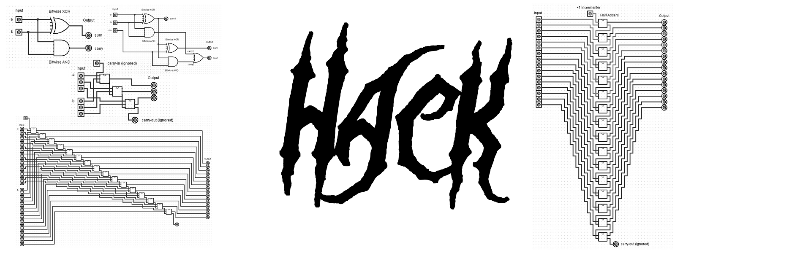

_"Hack is a general-purpose computer system, designed to strike a balance between simplicity and power. On the one hand, the Hack architecture can be built in just a few hours of work, [...] at the same time, Hack is sufficiently general to illustrate the key operating principles and hardware elements underlying the design of any digital computer."_ [_Elements of Computing Systems_ (ECS)](https://www.nand2tetris.org/book). I recommend getting this book. But it can be helpful to hence also look into the related [NAND to Tetris course](https://www.nand2tetris.org/course). 

+ **Not using any of the uncommon ECS-provided tools** but instead uses and explains **common tools in the industry** like [Verilog]() and [GtkWave](). 
+ Explains the circuits with the help of [Logisim](). 
+ Comes with an emulator written in [C]() or [Python]().
+ We'll write some [Assembly]() to play a little game!
+ Create an actual `.gds` mask with the [OpenLane PDK]().

## Start Here & Design Your Own
If you want to learn how to design a Hack computer and do all of the above, I documented every step of the process in the chapters below.
1. [Introduction](docs/1_Get_Started.md). Explains what we are going to do and guides you through the setup of all the tools. We'll end by writing a "Hello World!" of Verilog and simulating/testing it.
2. [Boolean Arithmetic](docs/2_Boolean_Arithmetic.md). Here, we'll create our first arithmetic modules, starting with a Half-Adder and ending with a complete, working Arithmetic Logic Unit (ALU).
3. [Sequential Logic](docs/3_Sequential_Logic.md). This chapter contains the code and notes for building registers for memory as well as a counter.
4. [Machine Language](docs/4_Machine_Language.md). This is where we'll write our first little program making use of the components we defined up to this point.
5. [Computer Architecture](docs/5_Computer_Architecture.md). We'll then finally put everything together, designing the whole hardware architecture of the computer containing, memory, instruction memory, and the CPU.
6. [Assembler](docs/6_Assembler.md). Finally, we'll write some Assembly for this computer concluding in an implementation of the game _Pong_.
7. [Conclusion](docs/7_Conclusion.md). Some concluding thoughts, ideas for the future, tips, and useful references.

