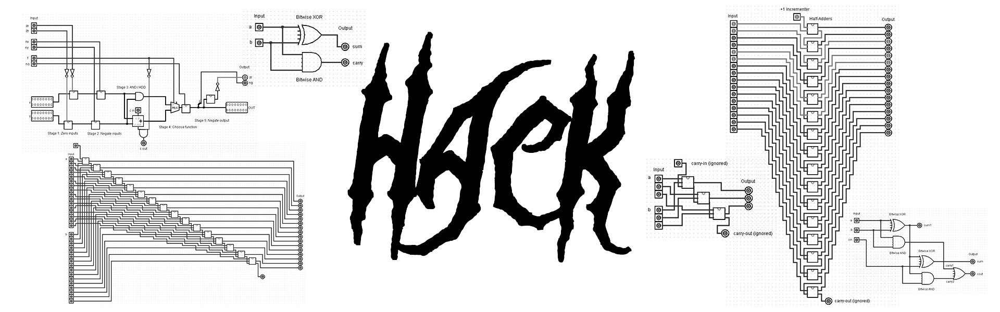

_"On the one hand, the Hack [general computer] architecture can be built in just a few hours of work, [...] at the same time, Hack is sufficiently general to illustrate the key operating principles and hardware elements underlying the design of any digital computer."_ [_Elements of Computing Systems_ (ECS)](https://www.nand2tetris.org/book). I recommend getting this book. But it can be helpful to hence also look into the related [NAND to Tetris course](https://www.nand2tetris.org/course). 

## Learn to Create the Architecture, Hardware, and Software
>[!Note]
>As of now, this project is a work in progress and the two points listed below are incomplete. If you are just starting out, it might be very helpful to get you started though.

+ Learn and use **common tools in the industry** like [Verilog](https://en.wikipedia.org/wiki/Verilog) and [GtkWave](https://gtkwave.github.io/gtkwave/install/win.html) to create and test the Hack computer architecture.
+ Explains all the circuits of the architecture with the help of [Logisim](http://www.cburch.com/logisim/).
<!--+ Learn how to use the provided emulator written in [C]() or [Python]().
+ Learn to write some [Assembly]() to make and play a little game. An example game and code is provided.
+ Create an actual `.gds` mask with the [OpenLane PDK](https://openlane2.readthesrc.io/en/latest/getting_started/newcomers/index.html) and see it in [KLayout](https://www.klayout.de/).
+ Visualize/render the 3D-chip using [IC3D](https://github.com/QuentinWach/IC3D).-->
_More is planned._

## Complete Workflow: Get Started!
If you want to learn how to design a Hack computer and do all of the above, I documented every step of the process in the chapters below.
1. [Introduction](src/1_Get_Started.md). Explains what we are going to do and guides you through the setup of all the tools. We'll end by writing a "Hello World!" of Verilog and simulating/testing it.
2. [Boolean Arithmetic](src/2_Boolean_Arithmetic.md). Here, we'll create our first arithmetic modules, starting with a Half-Adder and ending with a complete, working Arithmetic Logic Unit (ALU).
3. [Sequential Logic](src/3_Sequential_Logic.md). This chapter contains the code and notes for building registers for memory as well as a counter.
4. [Machine Language](src/4_Machine_Language.md). This is where we'll write our first little program making use of the components we defined up to this point.
5. [Computer Architecture](src/5_Computer_Architecture.md). We'll then finally put everything together, designing the whole hardware architecture of the computer containing, memory, instruction memory, and the CPU.
6. [Assembler](src/6_Assembler.md). Finally, we'll write some Assembly for this computer concluding in an implementation of the game _Pong_.
7. [Conclusion](src/7_Conclusion.md). Some concluding thoughts, ideas for the future, tips, and useful references.

