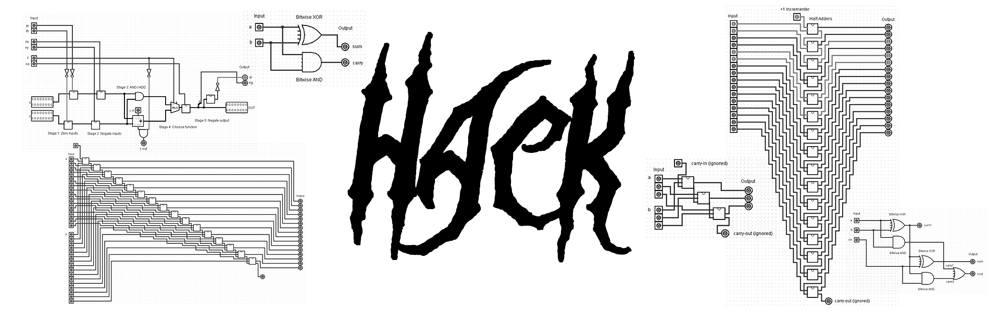

[](https://opensource.org/licenses/MIT)
[](https://GitHub.com/QuentinWach/HACK-CPU/commits/main)

_"On the one hand, the Hack [general computer] architecture can be built in just a few hours of work, [...] at the same time, Hack is sufficiently general to illustrate the key operating principles and hardware elements underlying the design of any digital computer."_ [_Elements of Computing Systems_ (ECS)](https://www.nand2tetris.org/book). I recommend getting this book. But it can be helpful to hence also look into the related [NAND to Tetris course](https://www.nand2tetris.org/course). 

## Learn to Create the Architecture, Hardware, and Software
>[!Note]
>As of now, this project is a work in progress and the two points listed below are incomplete. If you are just starting out, it might be very helpful to get you started though.

+ Learn and use **common tools in the industry** like [Verilog](https://en.wikipedia.org/wiki/Verilog) and [GtkWave](https://gtkwave.github.io/gtkwave/install/win.html) to create and test the Hack computer architecture.
+ Explains all the circuits of the architecture with the help of [Logisim](http://www.cburch.com/logisim/).
<!--+ Learn how to use the provided emulator written in [C]() or [Python]().
+ Learn to write some [Assembly]() to make and play a little game. An example game and code is provided.
+ Create an actual `.gds` mask with the [OpenLane PDK](https://openlane2.readthesrc.io/en/latest/getting_started/newcomers/index.html) and see it in [KLayout](https://www.klayout.de/).
+ Visualize/render the 3D-chip using [IC3D](https://github.com/QuentinWach/IC3D).-->
_More is planned._

## Complete Workflow: Get Started!
If you want to learn how to design a Hack computer and do all of the above, I documented every step of the process in the chapters below.
1. [Introduction](www.quentinwach.com/Hack-Computer/1_Get_Started.html). Explains what we are going to do and guides you through the setup of all the tools. We'll end by writing a "Hello World!" of Verilog and simulating/testing it.
2. [Boolean Arithmetic](www.quentinwach.com/Hack-Computer/2_Boolean_Arithmetic.html). Here, we'll create our first arithmetic modules, starting with a Half-Adder and ending with a complete, working Arithmetic Logic Unit (ALU).
3. [Sequential Logic](www.quentinwach.com/Hack-Computer/3_Sequential_Logic.html). This chapter contains the code and notes for building registers for memory as well as a counter.
4. [Machine Language](www.quentinwach.com/Hack-Computer/4_Machine_Language.html). This is where we'll write our first little program making use of the components we defined up to this point.
5. [Computer Architecture](www.quentinwach.com/Hack-Computer/5_Computer_Architecture.html). We'll then finally put everything together, designing the whole hardware architecture of the computer containing, memory, instruction memory, and the CPU.
6. [Assembler](www.quentinwach.com/Hack-Computer/6_Assembler.html). Finally, we'll write some Assembly for this computer concluding in an implementation of the game _Pong_.
7. [Conclusion](www.quentinwach.com/Hack-Computer/7_Conclusion.html). Some concluding thoughts, ideas for the future, tips, and useful references.


## Tools
Only a few tools are necessary. We use
+ [Visual Studio Code](https://code.visualstudio.com/) and
+ [Verilog HDL](https://en.wikipedia.org/wiki/Verilog)
to program the designs, 
+ [Icarus Verilog](https://github.com/steveicarus/iverilog?tab=readme-ov-file#table-of-contents) for simulation as it is easier to install than [Verilator](https://github.com/verilator/verilator) on Windows, and
+ [GTKWave](https://gtkwave.github.io/gtkwave/install/win.html) for waveform viewing.

Optionally, [Logisim](http://www.cburch.com/logisim/) can be a nice playground to test circuit ideas fast.

## Installing Logisim
Installing Logisim is as easy as downloading the `.exe` from http://www.cburch.com/logisim/ and following the install instructions. It is a compiled program with an intuitive GUI. You can then go ahead and immediately build your first digital circuits. In fact, Logisim is quite capable of simulating any computer you want to build. But while it is more intuitive and great for testing ideas, it is also quite time-consuming for larger projects to draw and connect every component yourself. That's just one of many reasons for why we have programmatic hardware description languages.

## Installing Icarus Verilog & GTK Wave
[Download Icarus here](https://bleyer.org/icarus/). THis installation program will include gtkwave as well. Make sure to use the most recent version and during installation check the installation path box so that you can open Icarus and verilog simply by typing
```
>gtkwave
```
which opens a nice little GUI which we'll discuss later or
```
>iverilog
```
which will just print out some text in your terminal. [This video](https://www.youtube.com/watch?v=FqIhFxf9kFM) might be of great help to you and it also shows you how to write, simulate, and visualize the signals of your Verilog modules. It really is that simple. The whole ecosystem simply has terrible, terrible documentation.

## The Basic Workflow
The workflow overall using these tools is pretty straightforward and we'll repeat it over and over.

**Step 1**: Create a Verilog file. We'll call this one `test.v`:

```verilog
module myModule();

initial
  begin
    $display("Hello World!");   // This will display a message
    $finish ; // This causes the simulation to end.  Without, it would go on..and on.
  end

endmodule
```

This module simply prints out the classic "Hello World!". Great! 

**Step 2**. We compile the `.v` file using Icarus:

```bash
>iverilog -o test.vvp test.v
```

The -o switch assigns a name to the output object file. Without this switch the output file would be called a.out. The hello.v indicates the source file to be compiled. There should be practically no output when you compile this source code, unless there are errors.

**Step 3**. You are ready to simulate this Hello World verilog program. To do so, invoke as such:
```bash
>vvp test.vvp 
Hello World!
```

Now, inside Visual Studio Code you can install the _Verilog HDL_ extension which adds a little green button at the top of the window which helps you compile your verilog code instead of you having to type the command out in the terminal every time.

**Step 4**. Visualize the waveforms/signals in gtkwave to check if our module functions as desired.

>...
>TODO
>...

## A Short Introduction to Verilog
Verilog is a hardware description language (HDL) used to model digital electronic systems. It can be used to describe hardware at various levels of abstraction, from high-level behavioral descriptions to low-level gate-level implementations allowing designers to simulate and synthesize digital circuits as hinted at before.

As we already saw as well, the basic unit of design in Verilog is a module which can represent anything from simple print statement or gate to highly complex systems. It has 
+ a port list (inputs and outputs)
+ and a body describing its functionality.

Verilog has two main data types: nets (like wires) and registers.
Common keywords are: wire, reg, integer, real, time.
Vectors can be declared to represent multiple bits (e.g., `wire [7:0] bus;`).
In this case, we have an 8-bit bus.

And importantly, there are various operations Verilog defines.

**Bitwise operators**: 
+ `&`: **Bitwise AND** - Performs a bitwise AND operation between corresponding bits of two operands. Each bit of the result is set to 1 if both corresponding bits of the operands are 1.
+ `|`: **Bitwise OR** - Performs a bitwise OR operation between corresponding bits of two operands. Each bit of the result is set to 1 if at least one of the corresponding bits of the operands is 1.
+ `^`: **Bitwise XOR** - Performs a bitwise exclusive OR (XOR) operation between corresponding bits of two operands. Each bit of the result is set to 1 if only one of the corresponding bits is 1.
+ `~`: **Bitwise NOT** - Performs a bitwise negation (complement) of the operand. It inverts each bit of its operand.

**Logical operators**:
+ `&&`: **Logical AND** - Returns true if both operands are non-zero (true), otherwise returns false. Unlike &, it operates on entire expressions, not individual bits.
+ `||`: **Logical OR** - Returns true if at least one of the operands is non-zero (true). Similar to &&, it operates on entire expressions.
+ `!`: **Logical NOT** - Returns true if the operand is zero (false), otherwise returns false. It inverts the boolean value of its operand.

**Arithmetic operators**: 
+ `+`: **Addition** - Adds two operands.
+ `-`: **Subtraction** - Subtracts the second operand from the first.
+ `*`: **Multiplication** - Multiplies two operands.
+ `/`: **Division** - Divides the first operand by the second operand. Note that in Verilog, division of integers results in integer division.
+ `%`: **Modulus** - Returns the remainder after division of the first operand by the second.

**Relational operators**: 
+ `==`: **Equality** - Returns true if both operands are equal.
+ `!=`: **Inequality** - Returns true if the operands are not equal.
+ `<`: **Less Than** - Returns true if the first operand is less than the second.
+ `>`: **Greater Than** - Returns true if the first operand is greater than the second.
+ `<=`: **Less Than or Equal To** - Returns true if the first operand is less than or equal to the second.
+ `>=`: **Greater Than or Equal To** - Returns true if the first operand is greater than or equal to the second.

**Shift operators**:
+ `<<`: **Logical Left Shift** - Shifts the bits of the first operand to the left by the number of positions specified by the second operand. Zeroes are shifted into the lower bits.
+ `>>`: **Logical Right Shift** - Shifts the bits of the first operand to the right by the number of positions specified by the second operand. Zeroes are shifted into the higher bits.

**Concatenation operator**:
+ `{}`: **Concatenation** - Combines multiple values or vectors into a single vector. For example, {A, B} concatenates the values A and B into a larger bit vector.

As I mentioned, we can define quite complex modules. Indeed, there are three different paradigms for how to do so: **Procedural Blocks**, **Behavioral Constructs**, and **Structural Constructs**. But more about that later.

Verilog supports specifying delays and timing constraints where `symbol` is used for delays in simulation.

Here is a simple example of a more practical Verilog module:
```Verilog
module d_flip_flop (
    input clk,    // Clock input
    input d,      // Data input
    output reg q  // Output
);

always @(posedge clk) begin
    q <= d;
end

endmodule
```
It describes a [D flip-flop]() that updates its **output _q_** with the value of **input _d_** on the rising edge of the **clock signal _clk_**. So we have two inputs (_clk, d_) and one output (_q_). The `reg` defines the data type as a register. A reg can hold a value between assignments, unlike a wire which does not store values.