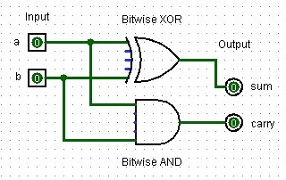
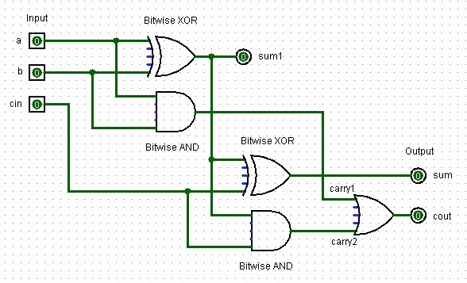
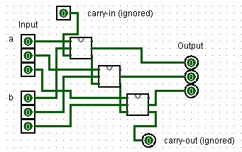
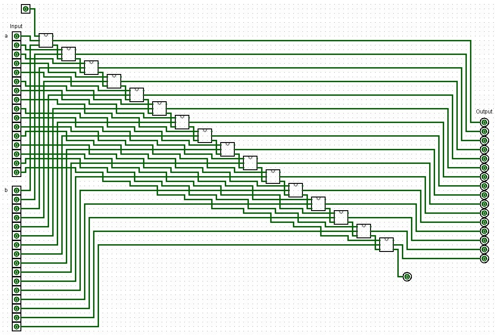
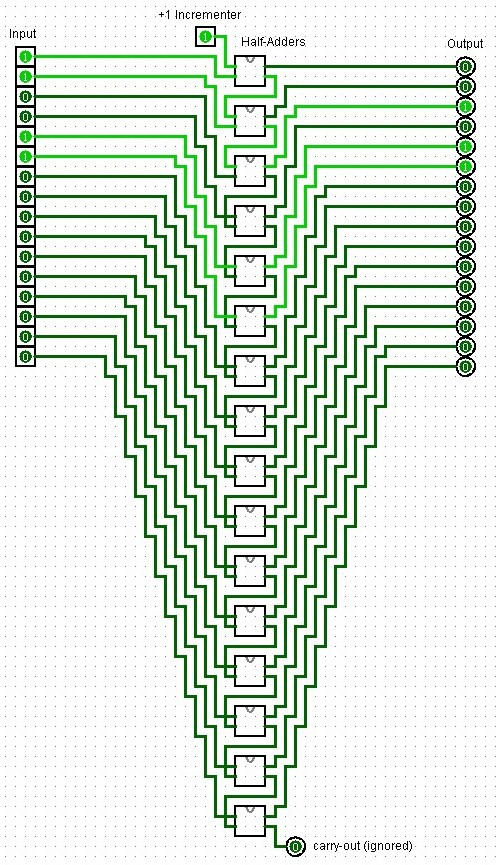
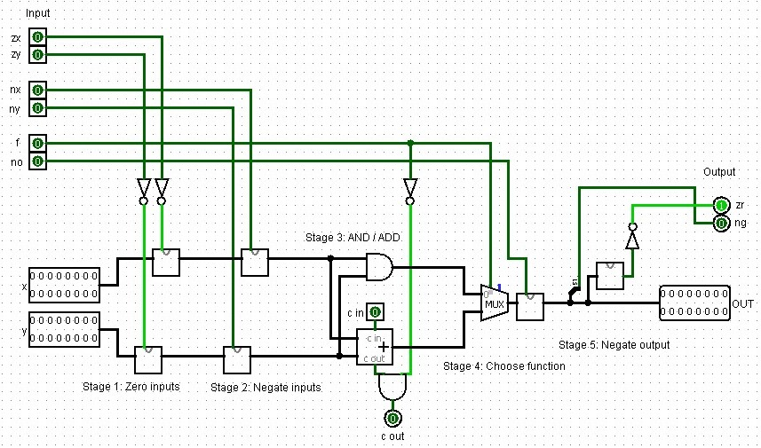

Let's build up the individual modules which are typical for ALUs within CPUs, step-by-step. Note that the HACK architecture is extremely simplified. Compare the Verilog I show below to that of other designs and you'll quickly notice the simplicity.

Open the `2_Boolean_Arithmetic.circ` Logisim file from the modules directory to try out and experiment with the circuits I present here.

## Half-Adder
A half-adder is a digital circuit that adds two single binary digits and produces a sum and a carry. The sum is the XOR of the inputs, while the carry is the AND of the inputs.

||
| :-: |
|A half-adder design created in Logisim with two input bits, two output bits, one bitwise XOR and one bitwise AND logic gate.|

```Verilog
module half_adder(
    input a, b,
    output sum, carry
);
    assign sum = a ^ b;
    assign carry = a & b;
endmodule
```
## Full-Adder
A full-adder adds three single binary digits (two inputs and one carry-in) and produces a sum and a carry-out. It's implemented using two half-adders and an OR gate.

||
| :-: |
|A full-adder design created in Logisim with two input signal bits, one control bit (cin), two output bits, one controt output bit (cout), and several XOR, AND and OR logic gates.|

```Verilog
module full_adder(
    input a, b, cin,
    output sum, cout
);
    wire sum1, carry1, carry2;
    
    half_adder ha1(.a(a), .b(b), .sum(sum1), .carry(carry1));
    half_adder ha2(.a(sum1), .b(cin), .sum(sum), .carry(carry2));
    
    assign cout = carry1 | carry2;
endmodule
```

## Adder
This is a 16-bit adder chaining 16 full-adders without carry-in or carry-out, as per HACK specifications. It's used in the ALU for addition operations. To illustrate the principle of how the half-adders are wired up, below is an image of a 3-bit adder I created in Logisim:

||
| :-: |
|A 3-bit adder design created in Logisim using full-adders.|

```Verilog
module adder(
    input [15:0] a, b,
    output [15:0] out
);
    wire [16:0] carry;
    assign carry[0] = 1'b0;
    
    genvar i;
    generate
        for (i = 0; i < 16; i = i + 1) begin : adder_loop
            full_adder fa(
                .a(a[i]),
                .b(b[i]),
                .cin(carry[i]),
                .sum(out[i]),
                .cout(carry[i+1])
            );
        end
    endgenerate
endmodule
```
Oh, what the heck. You know what? Here is the 16-Bit adder in its full glory as well:

||
| :-: |
|A 16-bit adder design created in Logisim using full-adders.|

## Incrementer
A simple 16-bit incrementer. Here, `out = in + 16'd1` assigns the result of `in + 16'd1` to the output out where...
+ `in`: The 16-bit input vector.
+ `16'd1`: A 16-bit representation of the decimal number 1. The d indicates that the value is in decimal. It is explicitly specified as 16-bit wide to match the width of the input and output vectors.
+ And hence `in + 16'd1` performs an addition of the input value with the constant value 1. 

```Verilog
module incrementer(
    input [15:0] in,
    output [15:0] out
);
    assign out = in + 16'd1;
endmodule
```
This seems rather simple to implement in Logisim. For example, we may use a 16-Bit adder and simply add 1 with the carry-in bit. Or add one with the second 16-bit number. But this is overly complex as we are essentially wasting 15 input bits and hence also all of the half-adders that would add those two inputs a and b together!

Instead, half-adders to the rescue!

||
| :-: |
|An incrementer design created in Logisim using half-adders.|

Where before we still had to generate a loop to add together our two 16-Bit numbers together, Verilog simplifies the increment by 1 quite a bit even though we require so many half-adders in our Logisim layout. In Verilog, the high-level abstraction provided by the language allows you to describe the desired behavior of a circuit rather than its specific implementation details, such as using a specific set of half-adders. While structural modeling like I did here in Logisim is important for learning and specific low-level design tasks, behavioral modeling is the preferred approach in most professional design scenarios due to its efficiency and flexibility.

## Arithmetic Logic Unit (ALU)
This ALU is specifically designed for the HACK computer and can perform 18 different operations based on the 6 1-bit control bits, which are encoded in the HACK machine language instructions:

```
zx: Zero the x input
nx: Negate the x input
zy: Zero the y input
ny: Negate the y input
f:  Function select (0 for AND, 1 for ADD)
no: Negate the output
```
It also has two status outputs:
```
zr: Set to 1 if the output is zero
ng: Set to 1 if the output is negative (MSB is 1)
```
The ALU performs operations in stages according to the control bits, allowing for a variety of computations using different combinations of these bits. Here is an implementation in Logisim similar to [jbchoinard's sixteen design (GitHub)](https://github.com/jbchouinard/sixteen). Instead of using the components we built though, I am using the internal ones in part since their UI is nicer. Sill, you could easily just use the adders we created before.

||
| :-: |
|A full Hack arithmetic logic unit design created in Logisim.|

In Verilog this looks like the code below. I heavily commented this code to explain it:
```Verilog
module alu(
    // This declares the ALU module with its inputs and outputs. The HACK ALU
    // operates on 16-bit numbers (x and y) and has 6 control bits (zx, nx, zy,
    // ny, f, no) that determine its operation. 
    // It outputs a 16-bit result (out) and two status flags (zr and ng).
    input [15:0] x, y,              // 16-bit inputs
    input zx, nx, zy, ny, f, no,    // 1-bit inputs
    output [15:0] out,              // 16-bit output
    output zr, ng                   // 1-bit outputs

);
    // These are internal wires used to connect the different stages of the ALU.
    wire [15:0] x1, y1, x2, y2, and_out, add_out, mux_out;

    // Stage 1: Zero inputs
    // If zx is 1, x1 becomes 0, otherwise it's x. Same for y and zy. 
    // This implements the "zero" functionality of the HACK ALU.
    assign x1 = zx ? 16'b0 : x;
    assign y1 = zy ? 16'b0 : y;

    // Stage 2: Negate inputs
    // If nx is 1, x2 becomes the bitwise NOT of x1, otherwise it's x1. 
    // Same for y2 and ny. This implements the "negate" functionality.
    assign x2 = nx ? ~x1 : x1;
    assign y2 = ny ? ~y1 : y1;

    // Stage 3: AND / ADD
    // This performs both AND and ADD operations on x2 and y2. 
    // The HACK ALU always computes both, then selects one based on the f bit.
    assign and_out = x2 & y2;
    adder add(.a(x2), .b(y2), .out(add_out));

    // Stage 4: Choose function
    // If f is 1, the output is the result of addition. 
    // If f is 0, it's the result of AND.
    assign mux_out = f ? add_out : and_out;

    // Stage 5: Negate output
    // If no is 1, the output is negated (bitwise NOT).
    assign out = no ? ~mux_out : mux_out;

    // Set zero and negative flags
    // zr is set to 1 if the output is zero. 
    // ng is set to 1 if the output is negative (most significant bit is 1).
    assign zr = (out == 16'b0);
    assign ng = out[15];

endmodule
```

Nice! With that we continue working on the sub-components we need to make sequential changes in our computer, like adding bits to memory and stepping forward in time using a clock.