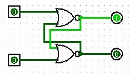

# Sequential Logic
The following building blocks, when combined with the ALU and other components, form the complete Hack computer system.

+ The D Flip-Flop (DFF) forms the basis for all memory elements.
+ The 1-Bit Register is used to construct larger memory units.
+ RAM8 and the parameterized RAM are used for data storage.
+ And the Counter is used as the program counter in the CPU, like a clock.

## DFF
The DFF stores a single bit. On each positive edge of the clock signal, it updates its output q with the value of the input d. Here is a Logisim implementation showing how we can actually store information. From here on out, I will focus on just the Verilog though.

||
| :-: |
|A flip-flop circuit storing a bit created in Logisim.|

```verilog
module DFF(
    input clk,
    input d,
    output reg q
);

always @(posedge clk) begin
    q <= d;
end

endmodule
```

>... Testing with GTKWave ...

## 1-Bit Register
The 1-Bit Register is a controllable DFF. It stores a single bit and updates its value when the load signal is high. The current state is continuously output.


```verilog
module Bit(
    input clk,
    input in,
    input load,
    output out
);

reg state;

always @(posedge clk) begin
    if (load)
        state <= in;
end

assign out = state;

endmodule
```

>... Testing with GTKWave ...

## 8-Register Memory (RAM8)
The RAM8 module is a small memory unit with 8 16-bit registers. It can store a value to a specified address when load is high, and continuously outputs the value at the current address.

```verilog
module RAM8(
    input clk,
    input [2:0] address,
    input [15:0] in,
    input load,
    output [15:0] out
);

reg [15:0] memory [0:7];

always @(posedge clk) begin
    if (load)
        memory[address] <= in;
end

assign out = memory[address];

endmodule
```

>... Testing with GTKWave ...

## n-Register Memory
This is a parameterized RAM module that can be instantiated with different sizes. It functions similarly to RAM8 but with a configurable number of registers. The `$clog2(SIZE)` determines the width of the address input based on the RAM size.

```verilog
module RAM(
    input clk,
    input [$clog2(SIZE)-1:0] address,
    input [15:0] in,
    input load,
    output [15:0] out
);

parameter SIZE = 16; // Default size, can be overridden

reg [15:0] memory [0:SIZE-1];

always @(posedge clk) begin
    if (load)
        memory[address] <= in;
end

assign out = memory[address];

endmodule
```

>... Testing with GTKWave ...

## Counter
The Counter is a 16-bit program counter for the Hack architecture. It can be reset to 0, loaded with a specific value, or incremented. This is typically used to keep track of the next instruction to be executed in the Hack computer.

```verilog
module Counter(
    input clk,
    input reset,
    input [15:0] in,
    input load,
    input inc,
    output reg [15:0] out
);

always @(posedge clk) begin
    if (reset)
        out <= 16'b0;
    else if (load)
        out <= in;
    else if (inc)
        out <= out + 1;
end

endmodule
```

>... Testing with GTKWave ...

Here is a little fun fact: If you have a 64 bit counter, and only ever increment it by 1, you may safely assume it will never overflow! Why? Well, if your 4GHz processor increments *every single clock cycle*, it will *still* take 146 years to overflow. So in practice: never. Assuming we use off-the-shelve ICs to build a bread board Hack computer. How about our 16 bit counter? When will it likely overflow? - Now, this is the _theory_ at least. In reality, this is based on several assumptions that do not apply to modern compute architectures. Having multiples cores, memory allocation optimization, multi-threading, ... I think all of these things break this calculus. That's why certain specialized applications require counters with even 128 bits.