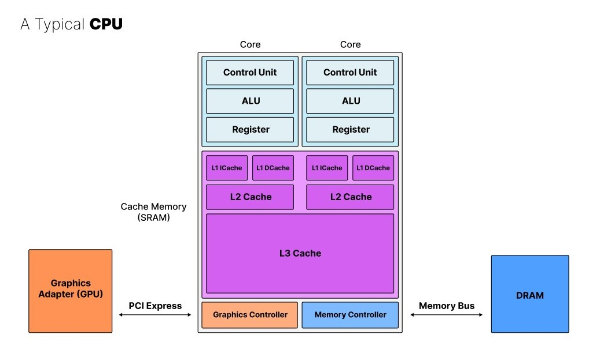
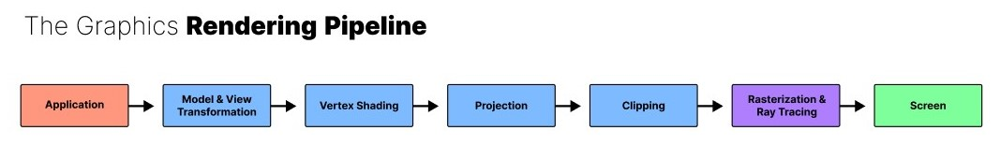

# Notes & Conclusion

**The ideal computer can handle diverse and complicated tasks in parallel.**
In reality though there are always trade-offs to be made which leads to why we develop different architectures most commonly the CPU and the Graphics Processing Unit (GPU).

**CPU**s are great at handling various diverse complicated tasks one by one.

**GPU**s are great at handling the many of the same simple tasks in parallel.

But there is much more to modern designs than I have talked about before.

### Modern CPUs
To summarize [this video](https://www.youtube.com/watch?v=_I8CLQazom0&list=PLTd6ceoshprfg23JMtwGysCm4tlc0I1ou), below, you can see a schematic overview of a typical CPU with multiple processing cores consisting of a control unit, ALU, and register coupled to various levels of cache memory (SRAM), and including a graphics controller which is typically connected to a GPU and a memory controller which in turn is connected to DRAM memory via a memory bus.

||
| :-: |
|Schematic overview of a typical modern CPU.|

The different caches operate at varying speeds to distribute data among the cores efficiently. To further optimize the data exchange between the cores and the memory, the L1 cache is split into an instruction cache (ICache) and data cache (DCache). The ICache only writes and hence tells the core which operations to execute while the DCache only writes and reads data to and from the core.

### Modern GPUs
Modern graphics are extremely data intensive (hence the PCI Express for greater bandwidth) and demand for parallel compute (hence vast amounts of cores a.k.a. "shader cores"). While there are many cores they all have comparatively simple instructions though. It follows the "Single Instruction, Multiple Data" (SIMD) paradigm. This is possible because there is a much more clear and repetitive pipeline for GPUs. After all, they were originally and are still primarily meant for graphics acceleration. Below, you can see an illustration of the graphics rendering pipeline (as summarized by [this video](https://www.youtube.com/watch?v=bZdxcHEM-uc)).

||
| :-: |
|Schematic overview of a typical GPU's graphics rendering pipeline.|

GPUs are quite general these days but they are still primarily optimized to handle graphics. So while they can also run parallel physics or neural networks, a dedicated physics processing unit or dedicated AI accelerators are still outperforming GPUs by a lot. The reason we do not see much of this yet is the ecosystem NVIDIA has built around their graphics cards and monopolizes. It will take time to build the software, workflows, hardware, and various integrations etc. for AI accelerators to take over. It will take even longer for this to happen for physics processors given that there is no clearly communicated demand for it on the market right now.

<!--
## Graphics Acceleration
NVIDIA likes to make people believe that their GPUs are General Processing Units rather Graphics Processing Units but it is no understatement to say that there goes in a lot to accelerate graphics which is far from optimal for accelerating anything else. 

The primary advantage of GPUs is the parallelism not the specialized processing elements.

At its heart, GPUs consist of a Graphics and Compute Array (GCA) a.k.a. the 3D engine which includes specialized Pixel and Vertex shaders aka CUDA cores, Texture Mapping Units (TMUs), Render Output Units (ROPs), L2 cache, Geometry processors, and more...

## Embarassingly Parallel Problems

## Cryptography

## Physics
A previous commercial physics processing unit only meant to accelerate game physics similar to how graphics processing units originally meant to accelerate and hence improve game graphics. But game physics is a typically a relatively minor contributor to the game experience which is why this capability was quickly integrated within graphics processing units as well making PPUs obsolete.

For reviving PPUs in the future, a more viable approach may be to develop PPUs for high-performance computing for scientific applications rather than gaming.

## Artificial Intelligence

-->

<!--## Future Ideas-->
<!--
Since there are so many other people who have already done quite similar projects, I do not plan to continue much further here. Still, general topics for future work may include:
### Software
+ Virtual Machine
+ High-Level Language
+ Compiler
+ Operating System
+ Running Doom?
+ Hardware emulator.
+ Compiler to code and run games on it in C or Python?
### Hardware
+ .gds Layout
+ TinyTapeout
+ FPGA tests
+ High resolution graphics to emulate a really cool retro game
  + Flappy Bird!
  + Fluid Simulation?
+ Assemble the computer on breadboards or PCB (provide files). 
-->