# Notes on Princeton's Computer Architecture Course (ELE 475)
A rigorous and in-depth course on modern computer architectures rather.

## Recommended Textbooks
+ Computer Architecture: A Quantitative Approach 5th Edition, Hennessey and Patterson (2012)
+ Modern Processor Design: Fundamentals of Superscalar Processors (John Oaul Shen, Mikko H. Lipasti) (2004)

You should know about computer organization (which are repeated in these classes here) and digital logic.

## Lecture 1: Introduction and Instruction Set Architectures
<!-- [Video uploaded: Jan 16, 2021](https://www.youtube.com/watch?v=9nuAjYRbITQ), watchded: Aug 8, 2024 -->

### What is Computer Architecture?
We take an application and map it down to the physics. The problem: The large gap between.
So we need a whole lot of **abstraction and implementations layers**. Computer architecture is the study of these layers.

Examples of similar abstraction layers are a compass or a book.

<!--||-->

|Hierarchy of Computer Engineering|
| :--: |
|Application|
Algorithm
Programming Language
Operating System/Virtual Machines
**Instruction Set Architecture**
**MIcroarchitecture**
**Register-Transfer Level**
Gates
Circuits
Devices
|Physics|
| This course is not about gates or Verilog but the three middle layers, the instruction set architecture, the microarchitecture, and the register-transfer level. We'll only talk a little about the other levels and how they influence those three we focus on. Application requirements may require a more specialized instruction set. Similarly, as the process node changes, this might make a new architecture possible. In turn, the architecture actually pushes up and down. It enables new applications and make demands for different processes and physics.|

### Back Then... and Now
People were thinking about computer architecture even back in the time when we still used relay computers that filled entire rooms. Now we have tiny systems with computers, cameras, smartphones, laptops, cars, sensors, GPS, eBooks, drones, and so on. So there is a lot of rich history. But this course mostly focuses on the technology rather than the history like most other classes.

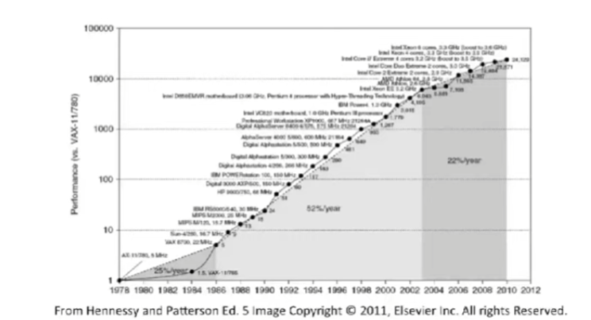

There has been an exponential increase in the performance of computers. This was mostly driven by Moore's Law. (Though personally, I would say it has been flattening for a long time.) 

At some point RISC was introduced. And more recently, multi-processors were introduced.  (Roughly in 2005). Why? Because sequential processors were starting to have problems. They were tapering off and not getting faster. So architectures were made more complex with more cores to compensate for this.

### Organization
Below, you can see a basic-pipelined processor with roughly 50,000 transistors. It is useful to know basic pipelining works as well as caching et cetera to understand the following notes.

|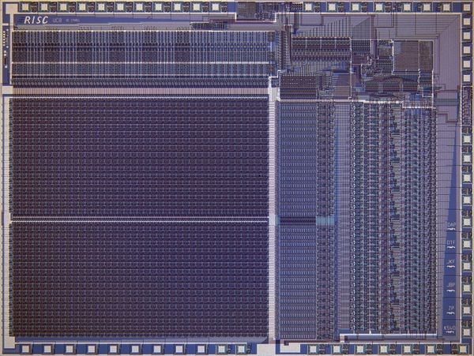|
|:--:|
|Photo of [Berkeley RISC 1](https://www.computerhistory.org/revolution/digital-logic/12/286/1591) which is a basic pipelined processor with only 44,420 transistors made with a 5 micron NMOS process. The 77 mm² chip ran at 1 MHz.|

In this class, instead of learning how to build very simplistic processors (like the one shown above), we'll learn how to design cutting edge processors like the Core i7 from Intel. This chip has 700M transistors and is much larger! No toy processor!
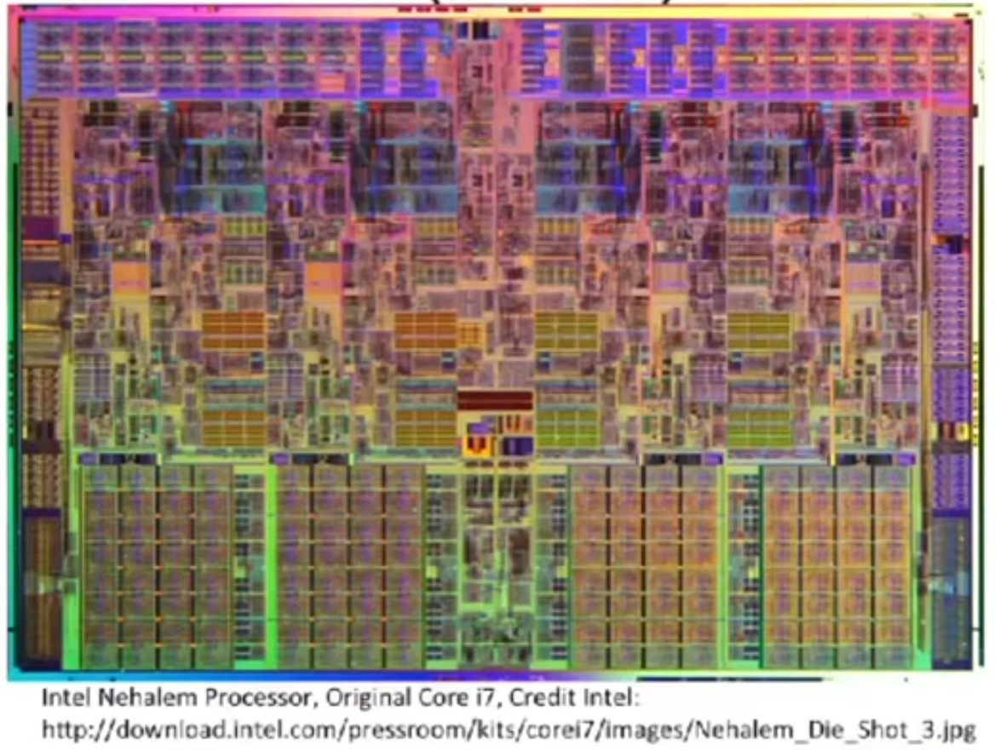

**How do we make processors fast?**

One answer is parallelism. Some techniques are implicit some explicit.
Another technique is to simply do less work. Just take out some steps for example with better compilers and run-time systems, removing instructions. A cache for example puts memory closer to the processor. So instead of having to walk down the street every time you need to get something from your car, you take a bin with you with all the useful things.

These are things we will talk about here:

+ Instruction Level Parallelism
  + Superscalar
  + Very Long Instruction Word (VLIW)
+ Long Pipelines (Pipeline Parallelism)
+ Advanced Memory and Caches
+ Data Level Parallelism
  + Vector
  + GPU
+ Thread Level Paralellism
  + Multithreading
  + Multiprocessing
  + Multicore
  + Manycore

### Architecture vs. Microarchitecture
For a lot of people this should be review. But we'll review it here.

**Instruction Set Archicture** (ISA) what instructions will the machine execute? What are the inputs and outputs? What are the datatypes? But it does not tell us HOW these are executed.
+ Programmer visible state (Memory & Register)
+ Operations e.g. ADD
+ Execution Semantics (io, interrupts, ...)
+ Input/Output
+ Data Types/Sizes

The **Microarchitecture**/Organization is the design that executes these programs/operations. It tells us HOW they are executed. And this is where we will need to make a lot of tradeoffs. Do we want more cost? More speed? Less energy consumption?
+ Tradeoff on how to implement the ISA for some metrics ( speed, energy, cost).
+ Examples: Pipeline depth, number of pipelines, execution ordering, bus widths, ALU widths.

### Software Developments
In the mid 60s we had our first libraries showing up (up to 1955). And then eventually higher-level languages showed up (1955-60s). Machines required experienced operators. Most people could not use computers or programs let alone write programs.

### Compatibility Problem at IBM
They had multiple lines for computers at IBM. Some for scientific computers. Some for businesses. But all of them had their own instruction set etc.

### IBM 360: A General-Purpose Register (GPR) Machine
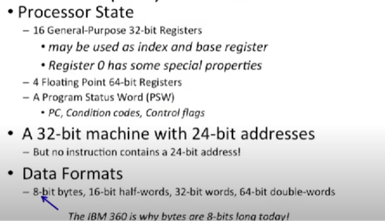
They came up with the idea here, for example, that bytes should be 8-bits long! 

Looking at the micro-architecture:
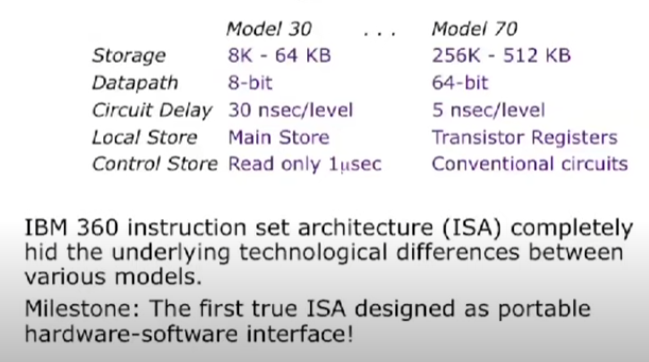


### Machine Models: Where Do Operand Come from and Where Do Results Go?
Instead or registers, we can just use a **stack**. Once the lowest element of the stack has been processed by the ALU, the results are send to the top of the stack and the next bottom element of the stack moves to the ALU.

Building on that, we could think of an **accumulator**. So we may have a memory element inside the processor but with every operation inside the ALU, we feed in both data from the internal memory element as well as data from the external (outside of the processor) memory, then feed the result from the processing back to the internal memory.

Next, we have **register-memory** where we may do the same thing as the accumulator but instead of overwriting the internal memory, we have a register and sort in our data at specific destinations.

And finally, there is the **register-register** design where all data movement is, again, inside the processor. Data comes from various sources of the register, is processed by the ALU, and the result is saved again somewhere in the internal register of the processor.

These different designs have a different amount of explicitly named operands (or just operands). The stack never needs to know where data goes since it is entirely deterministic and repetitive (explicit number of named operands = 0), the accumulator on the other hand needs to know where memory needs to be retrieved from (operands = 1). In the case of register memory, we need to know what register data and what memory data to pick and where to store the results (operands = 2, 3), and for register-register designs, the same applies again.

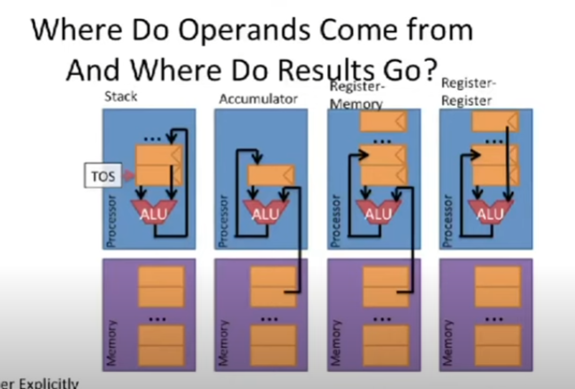

(There is also **memory-memory** which was popular in the 70s.)

>It is important that, the more operands you have named, the more encoding space do you need.

### Evaluating an Expression in a Stack
Let's take:
$$
(a+b \cdot c) / (a + d \cdot c -e)
$$
We can display this expression as a tree of operations as in the image below.

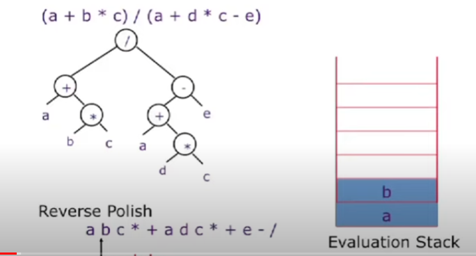

We may then start at the lower nodes and compute, in series,

```
load c (1)
load d (2)
f <-- mult c and d (1)
load a (2)
g <-- add a and f (1)
load e (2)
h <-- add e and g (1)
...
```

and so forth where the number in brackets on the right is the height of the stack. We have just computed this expression in series / sequentially using our evaluation stack.

In theory, such a stack is unbounded but in reality, we'd need to overflow the data from the stack to other memory.

If we suppose that the top elements of the stack are kept in registers and the rest is kept in memory, then every push and every pop has a memory reference which is not very good. Better performance can be achieved by keeping the top N elements in registers and only making memory references when the register stack overflows under underflows.

Here is another example:

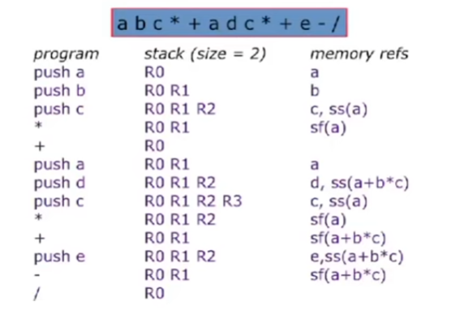

### Classes of Instructions and Data
Additionally to the type of machine model of the register we have, we have to choose the classes of instructions.

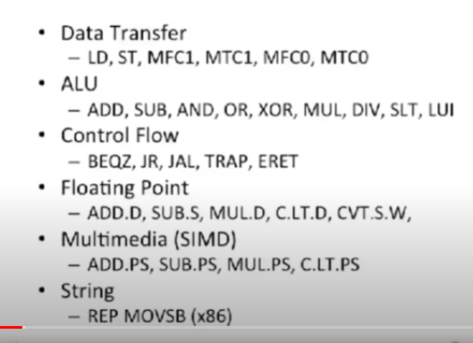

These instructions can be as complex as doing an entire Fourier transform with a single instruction.

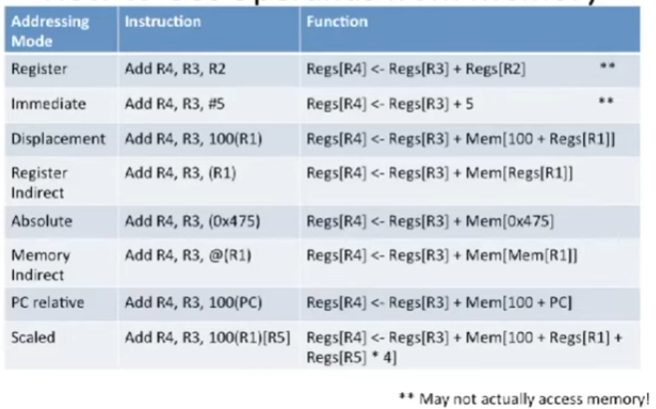

We also have to think about the data types and sizes:

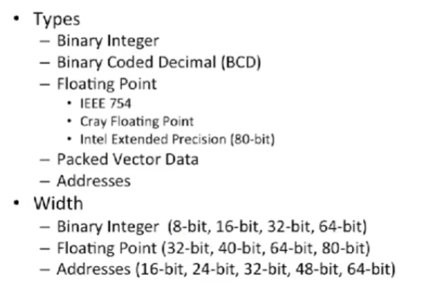

### ISA Encoding
The ISA can also be encoded in different ways: with a fixed and witha variable width.

Fixed width: Every instruction has same width. Easy to decode. Examples are RISC architectures, MIPS, PowerPC, SPARC, ARM. In MIPS, every instruction has 4 bytes.

Variable length: Instructions can vary in width. Takes less space in memory and caches. Examples are CISC architectures like IBM360, x86, Motorola 68k, VAC. in x86 instructions have lengths of 1 byte to 18-bytes! So the most common instructions can be made very compact to save a lot of space!

If STORE, LOAD, ADD and MUL are our most common insutructions, we could make them each 1-byte, right?

We can do Hoffman encoding.

---
But there are now also **mostly fixed** or compressed ISAs. And (Very) Long Instruction Word ISAs.

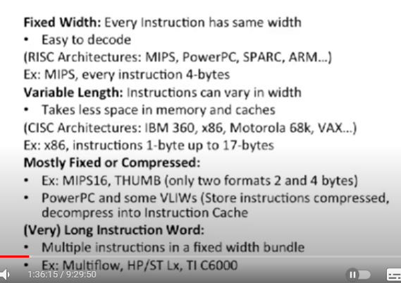

With mostly fixed we could for example say...

If we have 26 llop and 11 hlop instructions, we actually need 6 bits to encode these all.
```
      8 4 2 1 = 16
   16 8 4 2 1 = 32
32 16 8 4 2 1 = 64
```

>See https://en.wikipedia.org/wiki/Instruction_set_architecture !!!

```
ADD: 0
MUL: 1
LOAD: 00
STORE: 01
OR: 10
AND: 11
and so on?
```