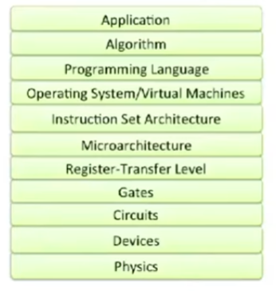

# Notes on Princeton's Computer Architecture Course (ELE 475)
A rigorous and in-depth course on modern computer architectures rather.

## Recommended Textbooks
+ Computer Architecture: A Quantitative Approach 5th Edition, Hennessey and Patterson (2012)
+ Modern Processor Design: Fundamentals of Superscalar Processors (John Oaul Shen, Mikko H. Lipasti) (2004)

You should know about computer organization (which are repeated in these classes here) and digital logic.

## Lecture 1: Introduction and Instruction Set Architectures
[Video uploaded: Jan 16, 2021](https://www.youtube.com/watch?v=9nuAjYRbITQ)
Video watchded: Aug 8, 2024

### What is Computer Architecture?
We take an application and map it down to the physics. The problem: The large gap between.
So we need a whole lot of **abstraction and implementations layers**. Computer architecture is the study of these layers.

Examples of similar abstraction layers are a compass or a book.

Application
Algorithm
Programming Language
Operating System/Virtual Machines
**Instruction Set Architecture**
**MIcroarchitecture**
**Register-Transfer Level**
Gates
Circuits
Devices
Physics

This course is not about gates or Verilog but the three middle layers, the instruction set architecture, the microarchitecture, and the register-transfer level. We'll only talk a little about the other levels and how they influence those three we focus on. Application requirements may require a more specialized instruction set. Similarly, as the process node changes, this might make a new architecture possible. In turn, the architecture actually pushes up and down. It enables new applications and make demands for different processes and physics.

### Back Then... and Now
People were thinking about computer architecture even back in the time when we still used relay computers that filled entire rooms. Now we have tiny systems with computers, cameras, smartphones, laptops, cars, sensors, GPS, eBooks, drones, and so on. So there is a lot of rich history. But this course mostly focuses on the technology rather than the history like most other classes.

There has been an exponential increase in the performance of computers. This was mostly driven by Moore's Law. (Though personally, I would say it has been flattening for a long time.) 

At some point RISC was introduced. And more recently, multi-processors were introduced.  (Roughly in 2005). Why? Because sequential processors were starting to have problems. They were tapering off and not getting faster. So architectures were made more complex with more cores to compensate for this.

### Organization
Here you can see a basic-pipelined processor with roughly 50.000 transistors. What you should have learned there is how basic pipelining works as well as caching et cetera.

In this class, instead of learning how to build very simplistic processors, we'll learn how to design cutting edge processors like the Core i7 from Intel. This chip has 700M transistors and is much larger! No toy processor!

**How do we make processors fast?**

One answer is parallelism. Some techniques are implicit some explicit.
Another technique is to simply do less work. Just take out some steps for example with better compilers and run-time systems, removing instructions. A cache for example puts memory closer to the processor. So instead of having to walk down the street every time you need to get something from your car, you take a bin with you with all the useful things.

These are things we will talk about here:

+ Instruction Level Parallelism
  + Superscalar
  + Very Long Instruction Word (VLIW)
+ Long Pipelines (Pipeline Parallelism)
+ Advanced Memory and Caches
+ Data Level Parallelism
  + Vector
  + GPU
+ Thread Level Paralellism
  + Multithreading
  + Multiprocessing
  + Multicore
  + Manycore

### Architecture vs. Microarchitecture
For a lot of people this should be review. But we'll review it here.

**Instruction Set Archicture** (ISA) what instructions will the machine execute? What are the inputs and outputs? What are the datatypes? But it does not tell us HOW these are executed.
+ Programmer visible state (Memory & Register)
+ Operations e.g. ADD
+ Execution Semantics (io, interrupts, ...)
+ Input/Output
+ Data Types/Sizes

The **Microarchitecture**/Organization is the design that executes these programs/operations. It tells us HOW they are executed. And this is where we will need to make a lot of tradeoffs. Do we want more cost? More speed? Less energy consumption?
+ Tradeoff on how to implement the ISA for some metrics ( speed, energy, cost).
+ Examples: Pipeline depth, number of pipelines, execution ordering, bus widths, ALU widths.

### Software Developments
In the mid 60s we had our first libraries showing up (up to 1955). And then eventually higher-level languages showed up (1955-60s). Machines required experienced operators. Most people could not use computers or programs let alone write programs.

### Compatibility Problem at IBM
They had multiple lines for computers at IBM. Some for scientific computers. Some for businesses. But all of them had their own instruction set etc.

### IBM 360: A General-Purpose Register (GPR) Machine

They came up with the idea here, for example, that bytes should be 8-bits long! 

Looking at the micro-architecture:

